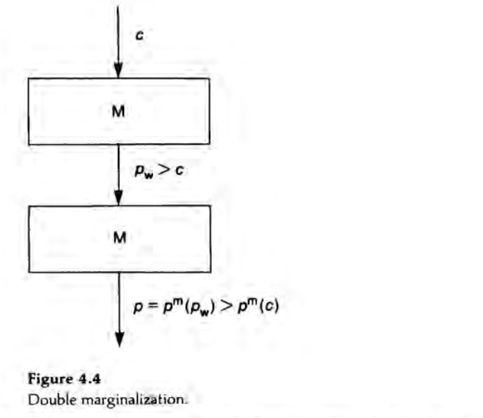

```{r setup, include=FALSE}
knitr::opts_chunk$set(echo = TRUE)
library(bookdown)
```

# Summary of the Paper

（ひとことメモ）


# 4.1 Linear Prices versus Vertical Restraints

## 4.1.1 Basic Framework

- A single supplier, called the _monopolist_ or the _manufacturer_, produces an intermediate good at a constant unit cost $c$.
- He is the only producer of this good.
- He sells it to a single downstream firm, called the _retailer_.
- The retailer resells the product.
- $p_{w}$ denotes the wholesale price and $p$ the consumer price.
- $q$ denotes the quantity bought by the retailer; it also denotes the final consumption if the retailer does not throw away any of the intermediate good.
- The consumers' demand function is denoted $q = D(p)$.


### Common Forms of Contracting

- A _linear price_ is a contract specifying only a payment, $T(q) = p_{w}q$ from the retailer to the manufacturer.
- A _franchise fee_, $A$, gives rise to the simplest example of a nonlinear price. The retailer then pays $T(q) = A + p_{w}q$
- _Resale-price maintenance (RPM)_ is a provision in the contract dectating the choice of the final price, $p$, to the retailer. Variants of this restraint are a price ceiling ($p \leq \overline{p}$) and a price floor ($p \geq \underline{p}$).
- _Quantity fixing_ specifies the amount, $q$ to be bought by the retailer. Variants of this restraint are quantity forcing ($q \geq \underline{q}$) and quantity rationing ($q \leq \overline{q}$)

## 4.1.2 Intrabrand Competition

- Introduce the possibility of competition among several retailers on the same market.
- New type of restraint: _exclusive territories_


## 4.1.3 Several Inputs

- Now assume that the downstream unit uses several inputs to produce the final good.
- The downstream unit can be a producer, or can be a retailer who sells complementary products to the customer.
- A new restraint: _tie in_, in which one of the input suppliers forces the downstream unit to purchase the other inputs from him.
- The manufacturer can also impose a payment, called a _royalty_, proportional to the number of units sold downstream.


## 4.1.4 Interbrand Competition

- The retailer may sell goods that are close substitutes for the good supplied by the manufacturer.
- The manufacturer may then impose _exclusive dealing_ on the retailer, which prevents him form selling goods that compete directly with the manufacturer's product.

# Externalities and Vertical Control

## Methodology

- The vertical structure determines a number of decision variables: wholesale price, franchise fee, quantity purchased by the retailer, consumer price, promotional effort, and so forth.
- In practice, only a few of these variables are observable and verifiable; these variables are called _instruments_.
- Let us call the sum of the manufacturer's and the retailer's profits the _aggregate profit_.
- The _targets_ form another subset of decision variables, which are those directly affecting the aggregate profit.

- Assume that the manufacturer chooses contract, and the retailers accept the contract only if it guarantees them at least what they would get by refusing it.

### 4.2.2 The Basic Vertical Externality

- The vertical externality is that any decision made by the retailer that increases his demand for the intermediate good by one unit generates an incremental profit of $p_{w} - c$ for the manufacturer.
- The retailer, who maximizes his own profit, does not take the manufacturer's incremental profit into account, and therefore tends to make decisions that lead too low a consumption of intermediate good.

**Example 1: Double Marginalization (Spengler 1950)**

- Suppose that the retailer's only decision is the retail price.
- The vertically integrated quantity $q_{m}$ and retail price $p_{m}$ are determined by $q_{m} = D(p_{m})$, and $p_{m}$ maximizes $(p - c)D(p).
- Consider the decentralized structure and the retailer's choice of the consumder price $p$ under linear wholesale tariff $T(q) = p_{w}q$.
- Assume that the manufacturer chooses the linear tariff first and the retailer chooses the consumer price second.
- The retailer is a monopolist in the retail market.



- The externality arises because the retailer does not take the manufacturer's marginal profit, $(p_{w} - c)D'(p)$, into account when choosing a retail price.
- To see this, assume that the final-demand function is $D(p) = 1 - p$ and that $c < 1$.
- Let $\Pi_{m}$ and $\Pi_{r}$ denote the manufacturer's and the retailer's profits.
- First, determine the equilibrium for the nonintegrated industry.
- The retailer solves

$$
\max_{p} [(p - p_{w})(1 - p)]
$$

from which it follows that

$$
p = \frac{1 + p_{w}}{2}
$$

- Then, the demand for the final good is 

$$
q = \frac{1 - p_{w}}{2}
$$

and the retailer's profit

$$
\Pi_{r} = \left( \frac{1 - p_{w}}{2} \right)^2
$$

- The manufacturer solves 

$$
\max_{p_{w}} \left[ (p_{w} - c)\left( \frac{1 - p_{w}}{2} \right) \right]
$$
from which it follows that

$$
p_{w} = \frac{1 + c}{2}
$$

- Notice that

$$
\Pi^{ni} = \Pi_{m} + \Pi_{r} = \frac{(1 - c)^2}{8} + \frac{(1 - c)^2}{16} = \frac{3}{16}(1 - c)^2
$$
and that
$$
p = \frac{3 + c}{4}
$$

- Now consider the integrated industry, which pays $c$ per unit for its input.
- It maximizes
$$
\max_{p}[(p - c)(1 - p)]
$$

from which it follows that

$$
p = \frac{1 +c}{2}
$$

- Then the total profit is 
$$
\Pi^{i} = \frac{(1 - c)^2}{4} > \Pi^{ni}
$$

- If one of the two firms is competitive in the sense that it sells at margineal cost, then vertical integration does not increase the profit of the monopoly firm.
- The intuition behind this result is that the competitive sector does not introduce a price distortion.
- Thus, the monopoly sector does not exercise an externality on the competitive sector, whose price-cost margin is zero.

<br />

- The double-marginalization problem is very similar to that of two monopoly producers of perfectly complementary goods.
- After all, production and retailing are complements, and consumers often consume both of them in fixed proportions.

**Sufficient Vertical Restraints**

**Franchise Fee**

- The manufacturer can realize the integrated profit without integration by using a two-part tariff: $T(q) = A + p_{w}q$.
- Recall that the issue with the linear price is that the downstream unit's marginal cost is not equal to the vertical structure's marginal cost.
- To eliminate this distortion, take $p_{w} = c$.
- The retailer maximizes
$$
(p - c)D(p) - A
$$

and thus chooses $p = p_{m}$.

- His profit is equal to

$$
\Pi^{m} - A
$$
where $\Pi^{m} = (p_{m} - c)D(p_{m})$.

- The manufacturer can then appropriate the retailer's profit by imposing a franchise fee equal to the vertibal structure's profit ($A = \Pi^{m}$).

**Resale-price maintenance**

- Rather than using a franchise fee, the manufacturer can sell the intermadiate good at price $p_{w} = p$ and then impose resale-price maintenance at $p = p^{m}$.
- The retailer then makes zero profit, and the vertical structur's aggregate profit equals $\Pi^{m}$.


**Welfare**

- The vertical structure makes more money under vertical integration under a linear price because it realized the vertical structure's monopoly profit.
- Consumers are better off under vertical integration because they face a lower price.
- Thus, welfare is unambiguously increased by the elimination of the double marginalization.

**Example 2: Downstream Moral Hazard**

- Retailers often provide services that make the manufacturer's good more attractive to consumers.
- We can gather all these under the heading "promotional effort" or "services."
- The manufacturer wants to encourage the retailer to supply it.
- The simplest way to do so would be to specify the level of promotional services in the contract.
- But such a contract would generally not be enforceable, as courts cannot measure such services precisely.
- Thus, incentives must be given to the retailer to overcome the associated moral-hazard problem.

<br />

- The consumer's demand is $q = D(p, s)$, where $s$ is the level of promotional services.
- $D$ decreases with $p$ and increases with $s$.
- Assume that supplying a level $s$ of services costs the retailer $\Phi(s)$ per unit of output, and that this cost can be observed by the retailer.
- $Phi$ increeases with $s$.
- The total service cost is thus $q\Phi(s)$

<br />

- The vertically integrated consuemr price ($p^{m}$) and services ($s^{m}$) maximize
$$
[p - c - \Phi(s)]D(p, s)
$$

- Let
$$
\Pi^{m} = [p^{m} - c - \Phi(s^{m})]D(p^{m}, s^{m})
$$

- In the decentralized structure, and for a linear price $p_{w}$, the profits are
$$
(p_{w} - c)D(p, s)
$$

for the manufacturer and
$$
[p - p_{w} - \Phi(s)]D(p, s)
$$

for the retailer.


